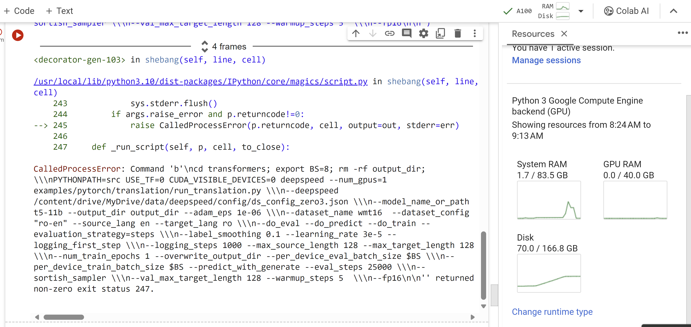

- The training t5_3b using 1 gpu (A100) on colab completed.
```
# DeepSpeed ZeRO-3 模式单 GPU 训练翻译模型（T5-3B）
%%bash

cd transformers; export BS=20; rm -rf output_dir; \
PYTHONPATH=src USE_TF=0 CUDA_VISIBLE_DEVICES=0 deepspeed --num_gpus=1 examples/pytorch/translation/run_translation.py \
--deepspeed /content/drive/MyDrive/data/deepspeed/config/ds_config_zero3.json \
--model_name_or_path t5-3b  \
--per_device_train_batch_size $BS \
--per_device_eval_batch_size $BS \
--output_dir output_dir --overwrite_output_dir \
--do_train \
--do_eval \
--max_train_samples 500 --num_train_epochs 1 \
--dataset_name wmt16 --dataset_config "ro-en" \
--source_lang en --target_lang ro \
--gradient_accumulation_steps 8 \
--fp16
  
```
  
- The training t5_11b using 1 gpu (A100) reported error when the used RAM close to 83.5 GB. I think the insufficient GPU memory because AMP requires additional GPU memory to store the half-precision values. If the GPU does not have enough memory, the training script may fail.

